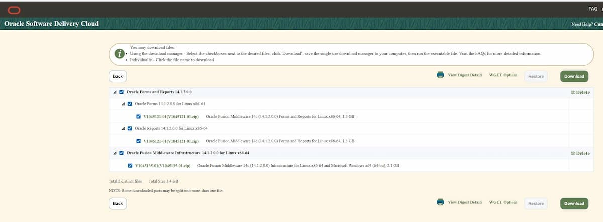

# Step 1b – 04-oracle_pre_download.sh

**Script:** `09-Install/04-oracle_pre_download.sh`
**Runs as:** `oracle`
**Phase:** 1 – Pre-Install Checks

---

## Download Sources

FMW 14.1.2 software comes from **two different sources** — the script handles both:

| Source | What | How |
|---|---|---|
| **eDelivery** (Oracle Software Delivery Cloud) | Base installers (V\*.zip) | Manual download, then unzip |
| **MOS** (My Oracle Support) | OPatch + individual patches | `getMOSPatch.jar` (automated) |

Credentials for MOS come from `environment.conf` (`MOS_USER`) and
`mos_sec.conf.des3` (encrypted password).

---

## Configuration File: oracle_software_version.conf

All versions, filenames, and patch numbers are defined in
`09-Install/oracle_software_version.conf`. This file is committed to git —
it contains no credentials.

### Base Installers (eDelivery)

| Variable | Value | Description |
|---|---|---|
| `FMW_INFRA_EDEL_SEARCH` | `Oracle Fusion Middleware Infrastructure 14.1.2.0.0 for Linux x86-64` | eDelivery search term |
| `FMW_INFRA_ZIP` | `V1045135-01.zip` | FMW Infrastructure ZIP (2.1 GB) |
| `FMW_INFRA_FILENAME` | `fmw_14.1.2.0.0_infrastructure.jar` | Extracted installer name |
| `FMW_INFRA_SHA256` | `1AAE35167B…D84E68BD` | SHA-256 checksum |
| `FMW_FR_EDEL_SEARCH` | `Oracle Forms and Reports 14.1.2.0.0` | eDelivery search term |
| `FMW_FR_ZIP` | `V1045121-01.zip` | Forms & Reports ZIP (1.3 GB) |
| `FMW_FR_FILENAME` | `fmw_14.1.2.0.0_fr_linux64.bin` | Extracted installer name |
| `FMW_FR_SHA256` | `01D7A1042F…373175B` | SHA-256 checksum |

> **Note:** `V1045121-01.zip` is listed on eDelivery under both *Oracle Forms 14.1.2.0.0* and
> *Oracle Reports 14.1.2.0.0* — it is the same file (1.3 GB). Download it once.
> Total cart size: **2 distinct files, 3.4 GB** (V1045135-01.zip + V1045121-01.zip).



### OPatch (getMOSPatch)

| Variable | Value | Description |
|---|---|---|
| `OPATCH_PATCH_NR` | `6880880` | Permanent MOS patch number for OPatch |
| `OPATCH_VERSION_MIN` | `13.9.4.2.4` | Minimum version required by highest patch group |

### Post-Install Patches (getMOSPatch, in apply order)

| Patch | Description | Requires OPatch |
|---|---|---|
| `30970477` | Security Patch – WebLogic Server 12.2.1.4 | ≥ 13.9.4.0 |
| `30729380` | Patch – Coherence 12.2.1.4 | ≥ 13.9.4.0 |
| `31960987` | Patch Set Update – WebLogic Server 12.2.1.4 | ≥ 13.9.4.2.4 |
| `32097167` | Overlay Patch – WebLogic Server 12.2.1.4 | ≥ 13.9.4.2.4 |

`INSTALL_PATCHES="30970477,30729380,31960987,32097167"` — apply in this order.
Always update OPatch **before** applying patches.

---

## Purpose

Download FMW 14.1.2 installers and patches into the patch storage directory.
Handles both eDelivery (verification/unzip) and MOS (getMOSPatch.jar) workflows.

---

## Without the Script (manual)

### 1. Download base installers from eDelivery

```
https://edelivery.oracle.com  →  Sign in  →  Software Delivery Cloud
Search: Oracle Fusion Middleware Infrastructure 14.1.2.0.0 for Linux x86-64
  → V1045135-01.zip   Oracle Fusion Middleware 14c Infrastructure for Linux x86-64, 2.1 GB
    SHA-1   F2FD0F9CBDEFEAB5857736609FCF65C32F0E4604
    SHA-256 1AAE35167BDED101E7194AA3D75C26B292010035A36C289A3F90B663D84E68BD

Search: Oracle Forms and Reports 14.1.2.0.0
  → V1045121-01.zip   Oracle Fusion Middleware 14c Forms and Reports for Linux x86-64, 1.3 GB
    SHA-1   FE811A063A3A51DB71CB5B1812580940147119BC
    SHA-256 01D7A1042F0896FA5BDDD1EA268C1B60452476032819AAA307A789B15373175B
    (same file listed under "Oracle Forms" and "Oracle Reports" – download once)
```

Place the ZIPs in the correct PATCH_STORAGE subdirectories:

```bash
mkdir -p $PATCH_STORAGE/wls $PATCH_STORAGE/fr

cp V1045135-01.zip $PATCH_STORAGE/wls/
cp V1045121-01.zip $PATCH_STORAGE/fr/

# Verify checksums
sha256sum $PATCH_STORAGE/wls/V1045135-01.zip
# expected: 1AAE35167BDED101E7194AA3D75C26B292010035A36C289A3F90B663D84E68BD

sha256sum $PATCH_STORAGE/fr/V1045121-01.zip
# expected: 01D7A1042F0896FA5BDDD1EA268C1B60452476032819AAA307A789B15373175B
```

Then use `04a-edelivery_download.sh --apply` to verify and unzip, or unzip manually:

```bash
unzip $PATCH_STORAGE/wls/V1045135-01.zip -d $PATCH_STORAGE/wls/
unzip $PATCH_STORAGE/fr/V1045121-01.zip  -d $PATCH_STORAGE/fr/
```

### 2. Set up getMOSPatch.jar

Download from GitHub: https://github.com/MarisElsins/getMOSPatch

```bash
mkdir -p $PATCH_STORAGE/bin
cp getMOSPatch.jar $PATCH_STORAGE/bin/
```

Create `$PATCH_STORAGE/bin/.getMOSPatch.cfg`:

```
226P;Linux x86-64
4L;German (D)
```

Platform codes: `226P` = Linux x86-64 · `233P` = Linux ARM 64 · `46P` = Windows x86-64

### 3. Download OPatch

```bash
mkdir -p $PATCH_STORAGE/opatch
cd $PATCH_STORAGE/opatch
java -jar $PATCH_STORAGE/bin/getMOSPatch.jar \
    MOSUser="your.email@company.com" \
    MOSPass="your-mos-password" \
    patch=6880880 download=all
```

### 4. Download individual patches

```bash
for PATCH_NR in 30970477 30729380 31960987 32097167; do
    mkdir -p $PATCH_STORAGE/patches/$PATCH_NR
    cd $PATCH_STORAGE/patches/$PATCH_NR
    java -jar $PATCH_STORAGE/bin/getMOSPatch.jar \
        MOSUser="..." MOSPass="..." \
        patch=$PATCH_NR download=all
done
```

### 5. Apply OPatch and patches (after FMW installation)

```bash
# 1. Update OPatch first
cd $ORACLE_HOME
java -jar $PATCH_STORAGE/opatch/p6880880_*.zip   # or: opatch/opatch_generic.jar

# 2. Verify OPatch version
$ORACLE_HOME/OPatch/opatch version
# Must be >= 13.9.4.2.4

# 3. Apply patches in order
for PATCH_NR in 30970477 30729380 31960987 32097167; do
    cd $PATCH_STORAGE/patches/$PATCH_NR
    $ORACLE_HOME/OPatch/opatch apply
done
```

---

## What the Script Does

- Reads `MOS_USER`, `PATCH_STORAGE` from `environment.conf`
- Reads software versions and patch numbers from `09-Install/oracle_software_version.conf`
- Decrypts MOS password from `mos_sec.conf.des3`
- **eDelivery ZIPs**: checks if already unzipped, verifies SHA256, extracts if needed
- **OPatch**: downloads via getMOSPatch if not already present, verifies version
- **Patches**: downloads missing patches via getMOSPatch, verifies SHA256
- Reports download summary: total size, files downloaded, files skipped

---

## Patch Storage Layout

```
$PATCH_STORAGE/
├── bin/
│   ├── getMOSPatch.jar
│   └── .getMOSPatch.cfg
├── wls/
│   ├── V1045135-01.zip
│   └── fmw_14.1.2.0.0_infrastructure.jar   ← extracted
├── fr/
│   ├── V1045121-01.zip
│   └── fmw_14.1.2.0.0_fr_linux64.bin       ← extracted
├── opatch/
│   └── p6880880_<version>_Generic.zip
└── patches/
    ├── 30970477/
    │   └── p30970477_*.zip
    ├── 30729380/
    │   └── p30729380_*.zip
    ├── 31960987/
    │   └── p31960987_*.zip
    └── 32097167/
        └── p32097167_*.zip
```

---

## Flags

| Flag | Description |
|---|---|
| (none) | Show what would be downloaded (sizes, checksums) |
| `--apply` | Execute downloads |
| `--force` | Re-download even if files already exist |
| `--help` | Show usage |

---

## Notes

- `getMOSPatch.jar` must be downloaded separately (open source, not bundled)
- MOS account requires an active Oracle support contract
- eDelivery account may require a separate registration at edelivery.oracle.com
- Always update OPatch **before** applying any patches
- Check each patch README for prerequisites and conflict checks
- OPatch minimum versions: Group 1 (30970477, 30729380) ≥ 13.9.4.0 · Group 2 (31960987, 32097167) ≥ 13.9.4.2.4
