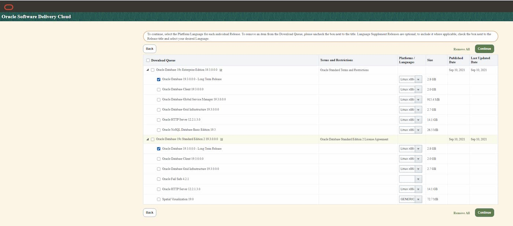

# Step 1 – 01-db_install_software.sh

**Script:** `60-RCU-DB-19c/01-db_install_software.sh`
**Runs as:** `oracle`
**Phase:** Install Oracle 19c Database software (no DB created yet)

---

## Purpose

Install the Oracle 19c Database software into a new ORACLE_HOME.
No database is created in this step — software only.

---

## Prerequisites

- `00-root_db_os_baseline.sh --apply` completed
- Oracle 19c installation ZIP placed at:
  `/srv/patch_storage/database/LINUX.X64_193000_db_home.zip`
- `environment_db.conf` configured (sources `environment.conf` for `PATCH_STORAGE`)
- oracle user, oinstall/dba groups present (set by preinstall RPM)
- At least 8 GB free under `ORACLE_BASE/product/`

---

## Download

> **The Oracle 19c base ZIP cannot be downloaded automatically.**
> Oracle eDelivery requires a browser session, license agreement acceptance, and
> an Oracle account — no scripted/automated download is possible for base
> software (unlike OPatch patches via getMOSPatch.jar).

### Manual download steps

1. Log in at **https://edelivery.oracle.com** with your Oracle account
2. Search for one of:
   - `Oracle Database 19c Standard Edition 2 19.3.0.0.0` — sufficient for RCU-only use
   - `Oracle Database 19c Enterprise Edition 19.3.0.0.0` — if you have an EE license
3. Select Platform: **Linux x86-64** and add to cart
4. Select: **Oracle Database 19.3.0.0.0 - Long Term Release**
5. Accept the license agreement and download



> EE and SE2 deliver **the same ZIP file** with the same checksums.
> The edition is determined by the license, not by the binary.

### File details

| Field | Value |
|---|---|
| Part number | `V982063-01` |
| Filename | `V982063-01.zip` → extract as `LINUX.X64_193000_db_home.zip` |
| Size | 2.8 GB |
| Platform | Linux x86-64 |
| Applies to | EE 19.3.0.0.0 and SE2 19.3.0.0.0 (identical file) |
| SHA-1 | `1F3ACEFFB3821464ED46E73A821CF07E5D2686E6` |
| SHA-256 | `BA8329C757133DA313ED3B6D7F86C5AC42CD9970A28BF2E6233F3235233AA8D8` |

Verify before installing:
```bash
sha256sum V982063-01.zip
# Expected: ba8329c757133da313ed3b6d7f86c5ac42cd9970a28bf2e6233f3235233aa8d8
```

6. Transfer to the server (scp / sftp) and rename:
```bash
scp V982063-01.zip oracle@dbserver:/srv/patch_storage/database/LINUX.X64_193000_db_home.zip
```

### Target path on the server

```
/srv/patch_storage/database/LINUX.X64_193000_db_home.zip
```

`PATCH_STORAGE=/srv/patch_storage` is defined in `environment.conf` and shared
across all project scripts.  The `database/` subdirectory keeps DB software
separate from FMW installers and patches:

```
/srv/patch_storage/
├── installers/     ← FMW installers (fmw_14.1.2_wls.jar, …)
├── patches/        ← FMW / WLS OPatch patches
└── database/       ← Oracle 19c DB base software (manual download)
    └── LINUX.X64_193000_db_home.zip
```

### Why only the base ZIP — no pre-patched download?

Oracle eDelivery only provides the 19.3.0 base release.  Current RU patches
are applied by AutoUpgrade in the next step (`02-db_patch_autoupgrade.sh`),
which downloads them automatically from MOS using `mos_sec.conf.des3`.

This means:
- **eDelivery** → base software only → manual, one-time
- **AutoUpgrade (MOS)** → RU + OJVM patches → automated, repeatable

---

## Installation

### 1. Create ORACLE_HOME directory

The 19c base install goes under `ORACLE_BASE/product/19.3.0/db_home1`:

```bash
# DB_ORACLE_HOME_BASE="${ORACLE_BASE}/product/19.3.0/db_home1"
mkdir -p "$DB_ORACLE_HOME_BASE"
chmod 775 "$DB_ORACLE_HOME_BASE"
```

After AutoUpgrade patching (step 2), the active ORACLE_HOME becomes
`$ORACLE_BASE/product/19.XX.0/db_home1` (`DB_ORACLE_HOME`).

### 2. Unzip into ORACLE_HOME

```bash
unzip -q "$DB_INSTALL_ARCHIVE" -d "$DB_ORACLE_HOME_BASE"
```

The 19c ZIP extracts directly into the target directory (unlike the old
runInstaller-with-stage approach).

### 3. Run installer (software-only)

> **ORACLE_HOME must be set explicitly here** — the oracle user's `.bash_profile`
> points to `FMW_HOME`, not to the DB home.  All scripts use `DB_ORACLE_HOME_BASE`
> to avoid any ambiguity.

```bash
"$DB_ORACLE_HOME_BASE/runInstaller" \
    -silent \
    -ignorePrereqFailure \
    -waitforcompletion \
    oracle.install.option=INSTALL_DB_SWONLY \
    ORACLE_BASE="$ORACLE_BASE" \
    ORACLE_HOME="$DB_ORACLE_HOME_BASE" \
    ORACLE_HOME_NAME="OraDB19Home1" \
    oracle.install.db.InstallEdition=EE \
    oracle.install.db.OSDBA_GROUP=dba \
    oracle.install.db.OSOPER_GROUP=oper \
    oracle.install.db.OSBACKUPDBA_GROUP=dba \
    oracle.install.db.OSDGDBA_GROUP=dba \
    oracle.install.db.OSKMDBA_GROUP=dba \
    oracle.install.db.OSKMDBA_GROUP=dba \
    SECURITY_UPDATES_VIA_MYORACLESUPPORT=false \
    DECLINE_SECURITY_UPDATES=true \
    2>&1 | tee -a "$LOG_FILE"
```

> SE2 alternative: change `InstallEdition=EE` to `InstallEdition=SE2`
> (sufficient for a single-PDB RCU-only database; see `docs/00-concept.md`).

### 4. Run root scripts (as root)

```bash
"$DB_ORACLE_HOME_BASE/root.sh"
```

The script prompts for this and pauses until confirmed.

---

## Verify Installation

```bash
$DB_ORACLE_HOME/OPatch/opatch lspatches
# Should show: 29517242 (19.3.0.0 base patch)

$DB_ORACLE_HOME/bin/sqlplus -V
# Should show: SQL*Plus: Release 19.0.0.0.0
```

---

## environment_db.conf Variables Used

```bash
ORACLE_BASE          # /u01/app/oracle — shared with FMW (from environment.conf)
DB_ORACLE_HOME_BASE  # ${ORACLE_BASE}/product/19.3.0/db_home1  — base install target
DB_INSTALL_ARCHIVE   # path to LINUX.X64_193000_db_home.zip
```

---

## Notes

- **Unified Auditing** is included in **all** Oracle Database releases starting with
  Oracle Database 12c — EE and SE2 alike.
  Mixed mode is active by default; pure Unified Auditing requires a one-time relink
  (`uniaud_on`) covered in Step 2.
  Source: [Oracle Unified Auditing FAQ](https://www.oracle.com/security/database-security/unified-auditing/faq/)

- **PDB (Pluggable Databases)**: without the Oracle Multitenant option, up to **3 PDBs**
  per CDB are permitted for all offerings — this applies explicitly to SE2 as well.
  One PDB for the RCU repository is well within this limit.
  Source: [Mike Dietrich – PDB with SE2](https://mikedietrichde.com/2020/01/29/can-you-have-more-than-1-pdb-with-standard-edition-2-se2/)

- Install Edition `EE` (Enterprise Edition) is required for:
  - Partitioning (used internally by some FMW schemas)
  - More than 3 PDBs per CDB (Oracle Multitenant option)
- `SECURITY_UPDATES_VIA_MYORACLESUPPORT=false` + `DECLINE_SECURITY_UPDATES=true`:
  suppresses the email notification prompt in silent mode
- The installer log is at: `$DB_BASE/oraInventory/logs/`
- After software install + root.sh, do NOT create a database yet — patch first
  (Step 2: `02-db_patch_autoupgrade.sh`)

---

## Troubleshooting

### [INS-08101] Unexpected error at state 'supportedOSCheck' / NullPointerException

> **Oracle Support KB76419 / MOS Doc ID 2584365.1**

**Symptom:**
```
[WARNING] [INS-08101] Unexpected error while executing the action at state: 'supportedOSCheck'
CAUSE: No additional information available.
SUMMARY: java.lang.NullPointerException
```

**Causes — one of the following:**

| Cause | Check |
|---|---|
| 19.3.0 not certified for OL8/OL9 | `cat /etc/oracle-release` — 19.3.0 only knows OL7 |
| `cvu_prereq.xml` not updated with platform info | present in 19.3.0 base, not yet patched |
| Minimum RU patch level not met | OL8 requires ≥ 19.6; OL9 requires ≥ 19.22 |
| `/tmp` mounted with `noexec` | `mount \| grep /tmp \| grep noexec` |

**Fix A — CV_ASSUME_DISTID (used by this script):**

```bash
export CV_ASSUME_DISTID=OEL7.6   # OL8/OL9: tell installer to treat host as OL7
./runInstaller ...
```

The script sets `CV_ASSUME_DISTID` from `DB_CV_ASSUME_DISTID` in `environment_db.conf`
(default: `OEL7.6`) and unsets it after the installer exits.

**Fix B — apply RU during install (alternative to AutoUpgrade approach):**

```bash
./runInstaller -applyRU /srv/patch_storage/patches/<RU_patch_number>
# OL8: RU ≥ 19.6  |  OL9: RU ≥ 19.22
```

This project uses AutoUpgrade (`02-db_patch_autoupgrade.sh`) instead — same result, more
repeatable.

**Fix C — /tmp noexec:**

```bash
mkdir -p /u01/app/oracle/tmp
export TMPDIR=/u01/app/oracle/tmp
export TMP=/u01/app/oracle/tmp
export TEMP=/u01/app/oracle/tmp
./runInstaller
```

**Certified minimum RU levels (MOS Doc ID 2584365.1):**

| OS | Minimum RU |
|---|---|
| OL 8 / RHEL 8 | 19.6.0.0 |
| OL 9 / RHEL 9 | 19.22.0.0 |
